## 数据监控系统

### 表结构设计




### Python Env

```shell
$ pyenv virtualenv 3.6.0 bd_data_monitoring_system_env
$ pyenv local bd_data_monitoring_system_env
$ pip install impyla
$ pip install psycopg2
```

### 开发计划

- [ ] 每日最新Hive数据加载到`metrics_metadata`表中
- [ ] 自动预算指标信息到`metrics_alert_metadata`表中
- [ ] 使用pREST构建看板API
- [ ] 使用pREST构建热力图API
- [ ] 使用pREST构建趋势图API
- [ ] 严重问题自动生成石墨文档发送dingding